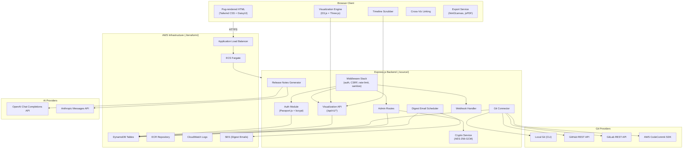
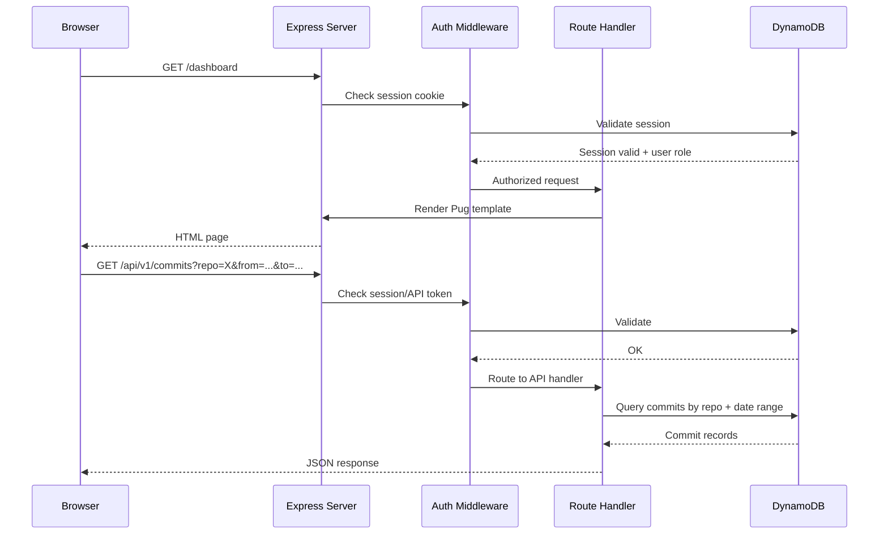

# Design Document: GInaTor

## Overview

GInaTor is a web-based git version control visualization tool that transforms raw git history into rich, interactive browser-based visualizations. The application follows a classic three-tier architecture: an Express.js backend serving Pug templates styled with Tailwind CSS/DaisyUI (adapted from the web-template-tailadmin template), a DynamoDB persistence layer, and a client-side visualization engine powered by D3.js and Three.js.

The system ingests commit data from four git provider types (Local, GitHub, GitLab, AWS CodeCommit), stores normalized commit records in DynamoDB, and renders 17 distinct visualization types in the browser. Users authenticate via email/password with an admin approval workflow, and admins configure repositories, AI providers, webhooks, sprint markers, and digest emails through a dedicated admin panel.

Key architectural decisions:
- **Server-rendered pages with client-side visualization**: Pug templates deliver the page shell; D3.js/Three.js render visualizations client-side from JSON API data
- **DynamoDB as sole data store**: All state (users, sessions, commits, configs, bookmarks, annotations) lives in DynamoDB, simplifying infrastructure
- **Provider-agnostic Git Connector**: A strategy pattern abstracts the four git provider types behind a common interface
- **Shared Timeline state**: A centralized client-side state manager synchronizes the Timeline Scrubber, all visualizations, and cross-visualization linking

## Architecture

### High-Level Architecture Diagram



### Request Flow



## Components and Interfaces

### Backend Components

#### 1. Auth Module (`source/modules/auth/`)

| Interface | Description |
|-----------|-------------|
| `POST /auth/register` | Register with email + password (≥8 chars). First user auto-approved as Admin. |
| `POST /auth/login` | Authenticate, create session, return session cookie. |
| `POST /auth/logout` | Invalidate session, clear cookie. |
| `GET /auth/status` | Return current user status (approved, pending, role). |

Internal services:
- `AuthService.register(email, password)` → validates, hashes (bcrypt cost 10+), stores user
- `AuthService.login(email, password)` → verifies credentials, creates session
- `AuthService.isApproved(userId)` → checks approval status
- Passport.js local strategy integration

#### 2. Admin Module (`source/modules/admin/`)

| Interface | Description |
|-----------|-------------|
| `GET /admin` | Render admin panel (Admin role required, 403 for non-admin, redirect for unauth) |
| `POST /admin/users/:id/approve` | Approve a pending user |
| `POST /admin/users/:id/reject` | Reject (delete) a pending user |
| `POST /admin/repos` | Create/update repository config |
| `DELETE /admin/repos/:id` | Delete repository config |
| `POST /admin/ai-config` | Set AI provider selection + API keys |
| `POST /admin/prompt` | Set release notes prompt template |
| `POST /admin/markers` | Create/update sprint/release markers |
| `POST /admin/digest` | Configure digest email settings |
| `POST /admin/webhooks/:repoId` | Configure webhook for a repository |

#### 3. Git Connector (`source/modules/git-connector/`)

Strategy pattern with four provider implementations:

```
GitConnector (interface)
├── LocalGitProvider    — executes `git log` via child_process
├── GitHubProvider      — GitHub REST API with PAT auth
├── GitLabProvider      — GitLab REST API with PAT auth
└── CodeCommitProvider  — AWS SDK v3 CodeCommitClient
```

| Method | Description |
|--------|-------------|
| `validate(config)` | Test connectivity/path validity for the provider |
| `fetchLog(config, sinceCommitHash?)` | Fetch full or incremental commit log |
| `parseWebhookPayload(payload)` | Extract commit refs from webhook (GitHub/GitLab only) |

Each provider returns a normalized `CommitRecord[]`:
```typescript
interface CommitRecord {
  repositoryId: string;
  commitHash: string;
  authorName: string;
  authorEmail: string;
  commitDate: string; // ISO 8601
  message: string;
  changedFiles: Array<{
    path: string;
    changeType: 'added' | 'modified' | 'deleted';
    additions?: number;
    deletions?: number;
  }>;
}
```

#### 4. Visualization API (`source/modules/api/`)

All endpoints under `/api/v1/`, authenticated via session cookie or API token.

| Endpoint | Description |
|----------|-------------|
| `GET /api/v1/commits` | Commits by repo + date range (paginated) |
| `GET /api/v1/stats` | Repo stats (contributor count, file count, date range, commit count) |
| `GET /api/v1/heatmap` | Contributor heatmap data (author × time grid) |
| `GET /api/v1/treemap` | File hotspot treemap data |
| `GET /api/v1/sunburst` | Code ownership sunburst data |
| `GET /api/v1/branches` | Branch/merge graph data |
| `GET /api/v1/pulse` | Commit velocity time series |
| `GET /api/v1/impact` | Impact burst data per commit |
| `GET /api/v1/collaboration` | Author collaboration network |
| `GET /api/v1/filetypes` | File type distribution |
| `GET /api/v1/activity-matrix` | Day/hour activity matrix |
| `GET /api/v1/bubblemap` | Bubble map data |
| `GET /api/v1/complexity` | Code complexity trend data |
| `GET /api/v1/pr-flow` | PR/MR review flow (GitHub/GitLab only) |
| `GET /api/v1/bus-factor` | Bus factor per file/directory |
| `GET /api/v1/stale-files` | Stale file list |
| `GET /api/v1/annotations` | Annotations for a repo |
| `GET /api/v1/bookmarks` | User's saved bookmarks |
| `GET /api/v1/docs` | API documentation page |

Common query parameters: `repoId`, `from` (ISO date), `to` (ISO date), `limit`, `offset`.

#### 5. Release Notes Generator (`source/modules/release-notes/`)

| Method | Description |
|--------|-------------|
| `generate(commits, provider, apiKey, promptTemplate)` | Send commits to AI provider, return formatted notes |

Delegates to `OpenAIAdapter` or `AnthropicAdapter` based on admin config.

#### 6. Webhook Handler (`source/modules/webhooks/`)

| Interface | Description |
|-----------|-------------|
| `POST /webhooks/:repoId` | Receive GitHub/GitLab webhook, validate signature, trigger incremental sync |

#### 7. Crypto Service (`source/modules/crypto/`)

| Method | Description |
|--------|-------------|
| `encrypt(plaintext, key)` | AES-256-GCM encrypt. Returns `{iv, ciphertext, authTag}` |
| `decrypt(encrypted, key)` | AES-256-GCM decrypt. Returns plaintext |

Used for all stored PATs, ARNs, and API keys.

#### 8. Digest Email Service (`source/modules/digest/`)

| Method | Description |
|--------|-------------|
| `generateDigest(repoIds, period)` | Compute stats for the period, format email HTML |
| `sendDigest(userEmails, digestHtml)` | Send via SES |

Triggered by a cron-like scheduler (e.g., `node-cron`).

### Frontend Components

#### Layout Structure

The frontend adapts the web-template-tailadmin layout pattern into Pug templates:

```
layout.pug                    — Base layout (html, head, body, sidebar, header, content area)
├── partials/
│   ├── header.pug            — App header (repo selector, stats bar, theme toggle, compare toggle, user menu)
│   ├── sidebar.pug           — Visualization switcher sidebar (17 viz types)
│   ├── timeline-scrubber.pug — Timeline bar with stacked area chart + range sliders
│   └── footer.pug            — Footer with credits link
├── pages/
│   ├── login.pug
│   ├── register.pug
│   ├── pending.pug
│   ├── dashboard.pug         — Main visualization page
│   ├── admin.pug             — Admin panel
│   ├── credits.pug           — Attribution page
│   └── diff-viewer.pug       — File diff viewer
```

#### Client-Side JavaScript Modules

```
source/public/js/
├── state/
│   └── AppState.js           — Central state (selected repo, date range, active viz, theme, scrub position)
├── timeline/
│   ├── TimelineScrubber.js   — D3 stacked area chart + range sliders + scrub mode
│   └── SprintMarkers.js      — Overlay markers on timeline
├── visualizations/
│   ├── TimeBloom.js          — Three.js WebGL radial tree animation
│   ├── CityBlock.js          — Three.js 3D city metaphor
│   ├── GenomeSequence.js     — D3 linear genome browser
│   ├── ContributorHeatmap.js — D3 grid heatmap
│   ├── FileHotspotTreemap.js — D3 treemap
│   ├── OwnershipSunburst.js  — D3 sunburst
│   ├── BranchMergeGraph.js   — D3 network graph
│   ├── CommitPulse.js        — D3 line chart
│   ├── ImpactViz.js          — D3 radial burst
│   ├── CollaborationNetwork.js — D3 force-directed graph
│   ├── FileTypeDistribution.js — D3 donut chart
│   ├── ActivityMatrix.js     — D3 matrix heatmap
│   ├── BubbleMap.js          — D3 bubble pack layout
│   ├── ComplexityTrend.js    — D3 line chart
│   ├── PRReviewFlow.js       — D3 Sankey diagram
│   ├── BusFactorView.js      — D3 table + overlay
│   └── StaleFileView.js      — D3 table + overlay
├── linking/
│   └── CrossVizLinker.js     — Pub/sub linking between visualizations
├── export/
│   └── ExportService.js      — html2canvas (PNG), SVG serialization, jsPDF (PDF)
├── diff/
│   └── DiffViewer.js         — Side-by-side / unified diff renderer
├── annotations/
│   └── AnnotationManager.js  — CRUD for timeline annotations
├── comparison/
│   └── ComparisonMode.js     — Side-by-side dual viz rendering
└── theme/
    └── ThemeToggle.js        — Dark/light theme switcher
```

#### Visualization Base Interface

All visualization modules implement a common interface:

```javascript
class VisualizationBase {
  constructor(containerId, appState) {}
  async load(repoId, dateRange) {}    // Fetch data from API, render
  update(dateRange) {}                 // Re-render for new date range
  scrubTo(commitIndex) {}             // Update for scrub position
  highlight(selection) {}              // Cross-viz linking highlight
  clearHighlight() {}                  // Remove cross-viz highlights
  resize() {}                          // Handle container resize
  exportSVG() {}                       // Return SVG element for export
  destroy() {}                         // Cleanup
}
```

### Middleware Stack

```javascript
// source/app.js middleware order
app.use(helmet());                     // Security headers
app.use(cors({ origin: config.origin }));
app.use(express.json());
app.use(express.urlencoded({ extended: true }));
app.use(csrfProtection);              // CSRF tokens on state-changing routes
app.use(sanitizeInput);               // XSS/NoSQL injection prevention
app.use(session({                     // express-session with DynamoDB store
  store: new DynamoDBStore({ ... }),
  secret: process.env.SESSION_SECRET,
  cookie: { secure: true, httpOnly: true, sameSite: 'strict' }
}));
app.use(passport.initialize());
app.use(passport.session());
app.use(rateLimiter('/auth/*'));       // Rate limiting on auth endpoints
```

## Data Models

### DynamoDB Table Schemas

#### Users Table

| Attribute | Type | Key | Description |
|-----------|------|-----|-------------|
| `userId` | String | PK | UUID |
| `email` | String | GSI-PK | Unique email address |
| `passwordHash` | String | — | bcrypt hash |
| `role` | String | — | `admin` or `user` |
| `status` | String | — | `approved`, `pending` |
| `themePreference` | String | — | `light` or `dark` |
| `digestOptOut` | Boolean | — | Opt-out of digest emails |
| `createdAt` | String | — | ISO 8601 |

GSI: `email-index` (PK: `email`) for login lookups.

#### Sessions Table

| Attribute | Type | Key | Description |
|-----------|------|-----|-------------|
| `sessionId` | String | PK | Session ID from express-session |
| `sessionData` | String | — | Serialized session data |
| `expires` | Number | — | TTL epoch for DynamoDB TTL auto-deletion |

#### Commits Table

| Attribute | Type | Key | Description |
|-----------|------|-----|-------------|
| `repositoryId` | String | PK | Repository identifier |
| `commitHash` | String | SK | Unique commit SHA |
| `authorName` | String | — | Commit author name |
| `authorEmail` | String | — | Commit author email |
| `commitDate` | String | GSI-SK | ISO 8601 date |
| `message` | String | — | Commit message |
| `changedFiles` | List | — | `[{path, changeType, additions, deletions}]` |
| `branch` | String | — | Branch name (when available) |

GSI: `repo-date-index` (PK: `repositoryId`, SK: `commitDate`) for date range queries.

#### RepositoryConfigs Table

| Attribute | Type | Key | Description |
|-----------|------|-----|-------------|
| `repoId` | String | PK | UUID |
| `name` | String | — | Display name |
| `providerType` | String | — | `local`, `github`, `gitlab`, `codecommit` |
| `providerConfig` | Map | — | Provider-specific config (path, URL, encrypted PAT/ARN) |
| `webhookSecret` | String | — | Encrypted webhook secret (GitHub/GitLab) |
| `lastSyncAt` | String | — | ISO 8601 last sync timestamp |
| `lastWebhookAt` | String | — | ISO 8601 last webhook sync timestamp |
| `createdAt` | String | — | ISO 8601 |

#### AdminSettings Table

| Attribute | Type | Key | Description |
|-----------|------|-----|-------------|
| `settingKey` | String | PK | Setting identifier |
| `settingValue` | String | — | Encrypted value (for keys) or plain value |

Keys stored: `aiProvider`, `openaiApiKey` (encrypted), `anthropicApiKey` (encrypted), `releaseNotesPrompt`, `digestEnabled`, `digestFrequency`, `digestRepoIds`, `encryptionKey` (derived from env var, not stored).

#### SprintMarkers Table

| Attribute | Type | Key | Description |
|-----------|------|-----|-------------|
| `repositoryId` | String | PK | Repository identifier |
| `markerId` | String | SK | UUID |
| `label` | String | — | Marker label |
| `date` | String | — | ISO 8601 date |
| `description` | String | — | Optional description |

#### Annotations Table

| Attribute | Type | Key | Description |
|-----------|------|-----|-------------|
| `repositoryId` | String | PK | Repository identifier |
| `annotationId` | String | SK | UUID |
| `targetType` | String | — | `commit` or `dateRange` |
| `targetCommitHash` | String | — | Commit hash (if commit target) |
| `targetDateFrom` | String | — | Start date (if date range target) |
| `targetDateTo` | String | — | End date (if date range target) |
| `label` | String | — | Annotation label |
| `description` | String | — | Optional description |
| `authorUserId` | String | — | Creator's user ID |
| `createdAt` | String | — | ISO 8601 |

#### Bookmarks Table

| Attribute | Type | Key | Description |
|-----------|------|-----|-------------|
| `userId` | String | PK | User ID |
| `bookmarkId` | String | SK | UUID |
| `name` | String | — | Bookmark display name |
| `repositoryId` | String | — | Repository ID |
| `visualizationType` | String | — | Active visualization type |
| `dateFrom` | String | — | Selected date range start |
| `dateTo` | String | — | Selected date range end |
| `createdAt` | String | — | ISO 8601 |

### Entity Relationship Diagram

```mermaid
erDiagram
    USER ||--o{ SESSION : has
    USER ||--o{ BOOKMARK : saves
    USER ||--o{ ANNOTATION : creates
    REPOSITORY_CONFIG ||--o{ COMMIT : contains
    REPOSITORY_CONFIG ||--o{ SPRINT_MARKER : has
    REPOSITORY_CONFIG ||--o{ ANNOTATION : has
    ADMIN_SETTINGS ||--|| REPOSITORY_CONFIG : configures

    USER {
        string userId PK
        string email
        string passwordHash
        string role
        string status
        string themePreference
    }
    COMMIT {
        string repositoryId PK
        string commitHash SK
        string authorName
        string authorEmail
        string commitDate
        string message
        list changedFiles
    }
    REPOSITORY_CONFIG {
        string repoId PK
        string name
        string providerType
        map providerConfig
    }
    BOOKMARK {
        string userId PK
        string bookmarkId SK
        string repositoryId
        string visualizationType
        string dateFrom
        string dateTo
    }
    ANNOTATION {
        string repositoryId PK
        string annotationId SK
        string label
        string authorUserId
    }
    SPRINT_MARKER {
        string repositoryId PK
        string markerId SK
        string label
        string date
    }

```

## Correctness Properties

*A property is a characteristic or behavior that should hold true across all valid executions of a system — essentially, a formal statement about what the system should do. Properties serve as the bridge between human-readable specifications and machine-verifiable correctness guarantees.*

### Property 1: Email and Password Validation

*For any* string pair (email, password), the registration validation function SHALL accept the input if and only if the email matches a well-formed email pattern (contains exactly one `@` with a non-empty local part and a domain with at least one dot) and the password is at least 8 characters long. All other inputs SHALL be rejected.

**Validates: Requirements 1.3**

### Property 2: Password Hashing Round-Trip

*For any* valid password string, hashing it with bcrypt (cost factor ≥ 10) and then verifying the original password against the resulting hash SHALL return true. Verifying any different password against the same hash SHALL return false.

**Validates: Requirements 1.4, 3.5**

### Property 3: Protected Route Authentication Enforcement

*For any* route path not in the public whitelist (`/auth/register`, `/auth/login`, static assets), an unauthenticated request SHALL receive either a 401 status or a redirect to the login page. No protected route SHALL return a 200 status to an unauthenticated request.

**Validates: Requirements 3.4**

### Property 4: Pending User Access Denial

*For any* protected application route and any user with `pending` status, the request SHALL be denied access and redirected to the pending approval page. No protected route SHALL return a 200 status to a pending user.

**Validates: Requirements 2.3**

### Property 5: Input Sanitization

*For any* user-supplied string containing HTML tags, JavaScript event handlers, or NoSQL operator patterns (`$gt`, `$ne`, `$where`, etc.), the sanitization function SHALL produce an output string that does not contain any executable script content or NoSQL operators.

**Validates: Requirements 3.6**

### Property 6: AES-256-GCM Encryption Round-Trip

*For any* plaintext string and any valid 256-bit encryption key, encrypting with AES-256-GCM and then decrypting with the same key SHALL produce the original plaintext. Decrypting with a different key SHALL throw an authentication error.

**Validates: Requirements 3.9**

### Property 7: Credential Exclusion from Unauthenticated Responses

*For any* API endpoint and any stored credential value (API keys, PATs, ARNs), an unauthenticated request's response body (including error responses) SHALL NOT contain the credential value as a substring.

**Validates: Requirements 3.10, 3.12, 3.13**

### Property 8: Git Log Parsing Completeness

*For any* raw git log entry containing a commit hash, author name, author email, date, message, and changed file list, the parsing function SHALL produce a `CommitRecord` where all fields are populated, the commit hash matches the input hash, the author fields match, the date is a valid ISO 8601 string, and the changed files list has the correct count with valid change types (`added`, `modified`, `deleted`).

**Validates: Requirements 5.5**

### Property 9: Incremental Sync Correctness

*For any* set of already-stored commits with a known latest commit date, and any set of new commits from the provider, the incremental sync SHALL return exactly those commits whose date is strictly after the latest stored commit date. No already-stored commit SHALL appear in the incremental result.

**Validates: Requirements 5.6**

### Property 10: Webhook Signature Validation

*For any* webhook payload and secret, computing the HMAC-SHA256 signature of the payload with the secret and then validating the payload against that signature SHALL succeed. Validating the same payload against a signature computed with any different secret SHALL fail.

**Validates: Requirements 6.3**

### Property 11: Commit Deduplication

*For any* commit record, storing it in the Commit_Store twice with the same `repositoryId` and `commitHash` SHALL result in exactly one record. The second store operation SHALL not produce an error and SHALL not create a duplicate.

**Validates: Requirements 7.2, 7.3**

### Property 12: Date Range Query Correctness

*For any* set of commits in a repository and any date range `[from, to]`, querying the Commit_Store by repository and date range SHALL return exactly those commits where `from ≤ commitDate ≤ to`, ordered by `commitDate` descending.

**Validates: Requirements 7.4, 7.5**

### Property 13: Repository Stats Computation

*For any* non-empty set of commits, the stats computation function SHALL return: `contributorCount` equal to the number of distinct `authorEmail` values, `fileCount` equal to the number of distinct file paths across all `changedFiles`, `firstCommitDate` equal to the minimum `commitDate`, `lastCommitDate` equal to the maximum `commitDate`, and `commitCount` equal to the total number of commits.

**Validates: Requirements 11.1**

### Property 14: Timeline Aggregation Invariant

*For any* set of commits bucketed into time intervals, the timeline aggregation function SHALL produce buckets where the sum of additions across all buckets equals the total additions across all commits, the sum of deletions equals the total deletions, and the sum of modifications equals the total modifications. No commit SHALL be counted in more than one bucket.

**Validates: Requirements 13.1, 13.2, 13.3**

### Property 15: Contributor Heatmap Aggregation

*For any* set of commits, the heatmap aggregation function SHALL produce a grid where each cell `(author, timePeriod)` contains the count of commits by that author in that time period, and the sum of all cell values equals the total number of commits.

**Validates: Requirements 19.1**

### Property 16: File Change Frequency Computation

*For any* set of commits, the file change frequency function SHALL return a mapping where each file's frequency equals the number of commits that include that file in their `changedFiles` list.

**Validates: Requirements 20.1**

### Property 17: Primary Contributor Computation

*For any* set of commits and any file path, the primary contributor function SHALL return the `authorEmail` that appears most frequently in commits touching that file. In case of a tie, the function SHALL deterministically select one author (e.g., alphabetically first).

**Validates: Requirements 21.2**

### Property 18: Commit Velocity Aggregation

*For any* set of commits and any granularity (daily, weekly, monthly), the commit velocity function SHALL produce time-series data points whose values sum to the total number of commits. Each data point's value SHALL equal the count of commits falling within that time period.

**Validates: Requirements 23.1**

### Property 19: Activity Spike Detection

*For any* time series of commit counts, the spike detection function SHALL flag exactly those data points whose value exceeds `mean + 2 × standardDeviation` of the series. No data point at or below the threshold SHALL be flagged.

**Validates: Requirements 23.7**

### Property 20: Author Collaboration Graph

*For any* set of commits, the collaboration graph SHALL contain an edge between two authors if and only if they have both modified at least one common file. The edge weight SHALL equal the count of distinct files that both authors have modified.

**Validates: Requirements 25.1, 25.3**

### Property 21: File Type Distribution

*For any* set of commits, the file type distribution function SHALL produce a mapping from file extension to change count, where each extension's count equals the number of `changedFiles` entries with that extension, and the sum of all counts equals the total number of file change entries across all commits.

**Validates: Requirements 26.1**

### Property 22: Activity Matrix Aggregation

*For any* set of commits with known timestamps, the activity matrix function SHALL produce a 7×24 grid where cell `(dayOfWeek, hour)` contains the count of commits occurring on that day at that hour, and the sum of all cells equals the total number of commits.

**Validates: Requirements 27.1**

### Property 23: Bus Factor Computation

*For any* set of commits and any file path, the bus factor function SHALL return the count of distinct `authorEmail` values in commits that include that file in their `changedFiles` list.

**Validates: Requirements 31.1**

### Property 24: Stale File Detection

*For any* set of commits, a reference date, and a staleness threshold in months, the stale file detector SHALL return exactly those files whose most recent `commitDate` is more than `threshold` months before the reference date. No file modified within the threshold SHALL appear in the stale list.

**Validates: Requirements 32.1**

### Property 25: View State URL Round-Trip

*For any* valid view state (visualization type from the 17 supported types, a date range with `from ≤ to`, and a repository ID), encoding the state into URL query parameters and then decoding those parameters back SHALL produce a view state identical to the original.

**Validates: Requirements 36.1, 36.2**

### Property 26: API Pagination Correctness

*For any* dataset of N items and any valid `limit` (1 ≤ limit ≤ N) and `offset` (0 ≤ offset < N), the paginated API response SHALL contain exactly `min(limit, N - offset)` items, matching the slice `fullResults[offset : offset + limit]` of the full sorted result set. The response SHALL include the total count N.

**Validates: Requirements 40.5**

### Property 27: Building Dimension Proportionality

*For any* two files where file A has a strictly greater line count than file B, the City Block visualization's computed building height for A SHALL be strictly greater than for B. Similarly, for any two files where file A has a strictly greater change frequency than file B, the computed footprint area for A SHALL be strictly greater than for B.

**Validates: Requirements 17.2**

## Error Handling

### Authentication Errors

| Scenario | Response | Details |
|----------|----------|---------|
| Invalid email format on registration | 400 Bad Request | `{ error: "Invalid email format" }` |
| Password too short on registration | 400 Bad Request | `{ error: "Password must be at least 8 characters" }` |
| Duplicate email on registration | 409 Conflict | `{ error: "Email already registered" }` |
| Invalid login credentials | 401 Unauthorized | Generic `{ error: "Invalid credentials" }` — no indication of which field is wrong |
| Unauthenticated access to protected route | 401 / redirect | Redirect to `/auth/login` for page requests; 401 JSON for API requests |
| Pending user access to protected route | 403 / redirect | Redirect to `/auth/pending` page |
| Non-admin access to /admin | 403 Forbidden | `{ error: "Forbidden" }` |
| Rate limit exceeded on auth endpoints | 429 Too Many Requests | `{ error: "Too many requests, try again later" }` |

### Git Connector Errors

| Scenario | Response | Details |
|----------|----------|---------|
| Invalid local path | 400 Bad Request | `{ error: "Path does not exist or is not a git repository" }` |
| GitHub/GitLab PAT invalid | 401 Unauthorized | `{ error: "Authentication failed for [provider]" }` |
| CodeCommit ARN invalid | 401 Unauthorized | `{ error: "Authentication failed for CodeCommit" }` |
| Network timeout during sync | 504 Gateway Timeout | `{ error: "Sync timed out for [repo name]" }` |
| Provider API rate limit | 429 Too Many Requests | `{ error: "[Provider] rate limit exceeded, retry after [time]" }` |

### Webhook Errors

| Scenario | Response | Details |
|----------|----------|---------|
| Invalid webhook signature | 401 Unauthorized | Logged; no repository details in response |
| Unknown repository in webhook | 404 Not Found | No configured repository details revealed |
| Malformed webhook payload | 400 Bad Request | `{ error: "Invalid webhook payload" }` |

### AI Provider Errors

| Scenario | Response | Details |
|----------|----------|---------|
| No AI provider configured | 400 Bad Request | `{ error: "No AI provider selected. Ask your admin to configure one." }` |
| API key not configured | 400 Bad Request | `{ error: "[Provider] API key not configured. Ask your admin." }` |
| AI provider API error | 502 Bad Gateway | `{ error: "[Provider] returned an error: [message]" }` |
| AI provider timeout | 504 Gateway Timeout | `{ error: "[Provider] request timed out" }` |

### Visualization API Errors

| Scenario | Response | Details |
|----------|----------|---------|
| Invalid query parameters | 400 Bad Request | `{ error: "Invalid parameters", details: [...] }` |
| Unauthenticated request | 401 Unauthorized | `{ error: "Authentication required" }` |
| Repository not found / no access | 404 Not Found | `{ error: "Repository not found" }` — no details revealed |
| Server error | 500 Internal Server Error | `{ error: "Internal server error" }` — details logged server-side only |

### Encryption Errors

| Scenario | Response | Details |
|----------|----------|---------|
| Decryption with wrong key | 500 Internal Server Error | Logged as critical; generic error to client |
| Corrupted ciphertext | 500 Internal Server Error | Logged as critical; generic error to client |

### Global Error Handling Strategy

- All unhandled errors caught by Express error middleware
- Error responses never include stack traces in production
- Error responses never include credential values regardless of auth status
- All errors logged with structured logging (timestamp, request ID, error type, message)
- DynamoDB `ConditionalCheckFailedException` on duplicate writes treated as success (idempotent)

## Testing Strategy

### Testing Framework and Libraries

| Library | Purpose |
|---------|---------|
| **Jest** | Test runner, assertions, mocking, coverage reporting |
| **Supertest** | HTTP integration testing for Express routes |
| **fast-check** | Property-based testing for data transformations and validation logic |

### Test Categories

#### 1. Property-Based Tests (fast-check)

Each correctness property from the design document maps to a single `fast-check` property test with a minimum of 100 iterations. Tests are tagged with the property reference.

| Property | Module Under Test | Generator Strategy |
|----------|-------------------|-------------------|
| P1: Email/Password Validation | `auth/validation` | `fc.emailAddress()`, `fc.string()`, `fc.nat()` for password length |
| P2: Password Hashing Round-Trip | `auth/hashing` | `fc.string({ minLength: 8, maxLength: 72 })` (bcrypt limit) |
| P3: Protected Route Auth | `middleware/auth` | `fc.constantFrom(...protectedRoutes)` |
| P4: Pending User Denial | `middleware/auth` | `fc.constantFrom(...protectedRoutes)` with pending user session |
| P5: Input Sanitization | `middleware/sanitize` | `fc.string()` mixed with injection patterns |
| P6: AES-256-GCM Round-Trip | `crypto/service` | `fc.string()`, `fc.uint8Array({ minLength: 32, maxLength: 32 })` |
| P7: Credential Exclusion | `middleware/auth` + API routes | `fc.constantFrom(...apiEndpoints)` |
| P8: Git Log Parsing | `git-connector/parser` | Custom `fc.record()` generating raw log entries |
| P9: Incremental Sync | `git-connector/sync` | `fc.array(commitRecordArb)` with `fc.date()` |
| P10: Webhook Signature | `webhooks/validator` | `fc.string()` for payload, `fc.string()` for secret |
| P11: Commit Deduplication | `commit-store` | `commitRecordArb` |
| P12: Date Range Query | `commit-store` | `fc.array(commitRecordArb)`, `fc.date()` pairs |
| P13: Repo Stats | `api/stats` | `fc.array(commitRecordArb, { minLength: 1 })` |
| P14: Timeline Aggregation | `api/timeline` | `fc.array(commitRecordArb)` |
| P15: Heatmap Aggregation | `api/heatmap` | `fc.array(commitRecordArb)` |
| P16: File Change Frequency | `api/treemap` | `fc.array(commitRecordArb)` |
| P17: Primary Contributor | `api/sunburst` | `fc.array(commitRecordArb)` |
| P18: Commit Velocity | `api/pulse` | `fc.array(commitRecordArb)`, `fc.constantFrom('daily','weekly','monthly')` |
| P19: Spike Detection | `api/pulse` | `fc.array(fc.nat({ max: 1000 }), { minLength: 3 })` |
| P20: Collaboration Graph | `api/collaboration` | `fc.array(commitRecordArb)` |
| P21: File Type Distribution | `api/filetypes` | `fc.array(commitRecordArb)` |
| P22: Activity Matrix | `api/activity-matrix` | `fc.array(commitRecordArb)` |
| P23: Bus Factor | `api/bus-factor` | `fc.array(commitRecordArb)` |
| P24: Stale File Detection | `api/stale-files` | `fc.array(commitRecordArb)`, `fc.date()`, `fc.nat({ min: 1, max: 24 })` |
| P25: URL State Round-Trip | `state/url-encoder` | `fc.record({ vizType, dateFrom, dateTo, repoId })` |
| P26: Pagination | `api/pagination` | `fc.array(fc.anything())`, `fc.nat()` for limit/offset |
| P27: Building Dimensions | `api/city-block` | `fc.array(fileMetricArb)` |

**Shared Arbitrary (Generator):**

```javascript
const commitRecordArb = fc.record({
  repositoryId: fc.constantFrom('repo-1', 'repo-2', 'repo-3'),
  commitHash: fc.hexaString({ minLength: 40, maxLength: 40 }),
  authorName: fc.string({ minLength: 1, maxLength: 50 }),
  authorEmail: fc.emailAddress(),
  commitDate: fc.date({ min: new Date('2020-01-01'), max: new Date('2025-12-31') })
    .map(d => d.toISOString()),
  message: fc.string({ minLength: 1, maxLength: 200 }),
  changedFiles: fc.array(
    fc.record({
      path: fc.stringOf(fc.constantFrom(...'abcdefghijklmnopqrstuvwxyz/._-'.split('')), { minLength: 3, maxLength: 50 }),
      changeType: fc.constantFrom('added', 'modified', 'deleted'),
      additions: fc.nat({ max: 500 }),
      deletions: fc.nat({ max: 500 })
    }),
    { minLength: 1, maxLength: 20 }
  )
});
```

**Tag format:** Each test includes a comment:
```javascript
// Feature: ginator, Property 1: Email and Password Validation
```

#### 2. Unit Tests (Jest)

Focus on specific examples, edge cases, and error conditions not covered by property tests:

- **Auth module**: First user gets admin role, duplicate email rejection, session creation/invalidation, bcrypt cost factor verification
- **Admin module**: Role-based access (403 for non-admin), CRUD operations for repo configs, AI provider config, sprint markers
- **Git Connector**: Provider-specific error handling, timeout behavior, malformed response handling
- **Crypto Service**: Edge cases (empty string encryption, max-length strings)
- **Release Notes Generator**: Provider selection logic, error message formatting per provider
- **Webhook Handler**: Signature validation failure logging, unknown repo handling
- **Digest Email**: Opt-out filtering, email failure isolation

#### 3. Integration Tests (Jest + Supertest)

End-to-end flows testing the full request/response cycle:

- Registration → login → session → access protected route → logout
- Admin configures repo → triggers sync → commits stored → API returns data
- Webhook received → signature validated → commits ingested → deduplication verified
- Release notes: select date range → call generate → AI provider called → notes returned
- Bookmark: save view state → load bookmark → state restored
- Theme: set preference → logout → login → preference restored

#### 4. Infrastructure Tests

- Terraform `validate` and `plan` for syntax and configuration correctness
- Docker build verification
- DynamoDB Local table creation script verification

### Coverage Target

- Minimum 80% statement coverage across all backend modules (as required by Requirement 45.5)
- Property tests provide high branch coverage on data transformation functions through randomized input exploration
- Integration tests cover critical user flows end-to-end

### Test Organization

```
source/
├── __tests__/
│   ├── unit/
│   │   ├── auth/
│   │   ├── admin/
│   │   ├── git-connector/
│   │   ├── crypto/
│   │   ├── release-notes/
│   │   ├── webhooks/
│   │   └── digest/
│   ├── property/
│   │   ├── validation.property.test.js
│   │   ├── hashing.property.test.js
│   │   ├── crypto.property.test.js
│   │   ├── parsing.property.test.js
│   │   ├── commit-store.property.test.js
│   │   ├── stats.property.test.js
│   │   ├── aggregations.property.test.js
│   │   ├── collaboration.property.test.js
│   │   ├── bus-factor.property.test.js
│   │   ├── stale-files.property.test.js
│   │   ├── url-state.property.test.js
│   │   ├── pagination.property.test.js
│   │   └── city-block.property.test.js
│   └── integration/
│       ├── auth-flow.integration.test.js
│       ├── sync-flow.integration.test.js
│       ├── webhook-flow.integration.test.js
│       ├── release-notes.integration.test.js
│       ├── bookmark-flow.integration.test.js
│       └── api-endpoints.integration.test.js
```
